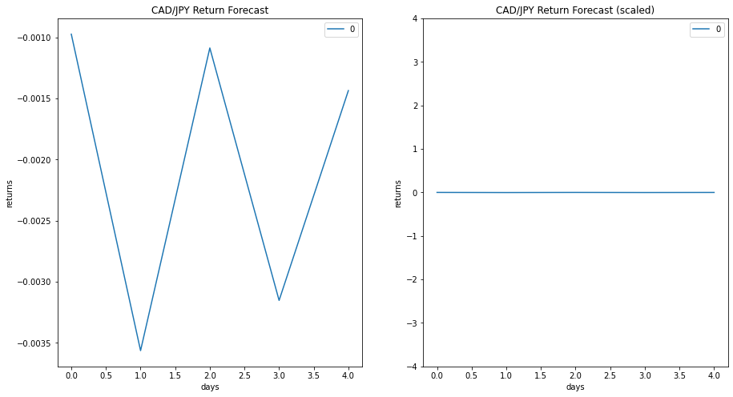
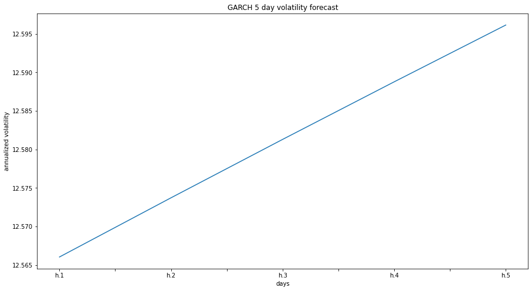
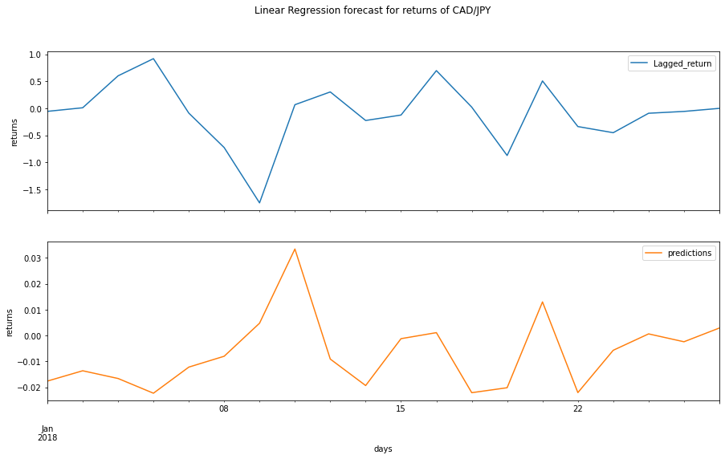

# Fintech--Time-Series-Analysis

---
## Time series analysis

CAD/JPY time series was decomposed into its trend and noise components using a Hodrick-Prescott (HP) Filter. Returns, price and volatility predictions were made using ARMA, ARIMA and GARCH models.

---
### HP-filter/time series

Visualisation of the time series and comparison of the trend to price over the 2015-2019 period displays a negative trend over time. The noise component of the HP filter displays increased activity around the 2008-2009 period and is liekly attributed to the gfc (seef fig3). 

---
### ARMA

An order (2,1) Autoregressive-Moving-Average (ARMA) model was used to forecast returns of the CAD/JPY using data from a 30 year period. Daily returns were calculated from price and used for the model.

Based on the p values, the model has successfully described the first component of the time series (ar.L1, p=0.000) and the moving average (ma, p=0.000), however, the p values for the constant (c, p=0.807) and second component of the time series (ar.L2, p=0.140) are not statistically significant, leading to a model with poor performance. This is reflected when return predictions were calculated and visualised (see fig 4), it is evident that the model is applying some level of predictive behavour. However, the values of the predictions are completely irrelevant when considering the scale of the daily returns for the CAD/JPY.

---
### ARIMA

An order (5,1,1) Autoregressive Integrated Moving Average (ARIMA) model was used to forecast the price movement of the CAD/JPY using the same price data used for the ARMA model. 

The p values for the ARIMA the model were similar to that of the ARMA model, with the moving average (ma, p=0.064) being relativly robust, however the other components and the constant (c, p=0.458) were not statisticaly significant, as such, the model has similar downfalls to that of the ARMA model (see fig 5).

---
### GARCH

An order (2,1) Generalized AutoRegressive Conditional Heteroskedasticity (GARCH) model was used to forecast volatility in the CAD/JPY market, much like the ARMA model, returns were used as an input to the model. Outputs from the garch model were annualized and plotted as daily volatility forecasts (see fig 6).

p values for the GARCH model indicate a much higher level of confidence in the model predictions with all p values being < 0.5, except for alpha[2]. 

---
## Regression analysis

A linear regression model has been used to predict returns for the currency pariring, model evaluation was done using rmse values for in sample and out of sample data.

An rmse of 0.84 for the in sample data indicates a good fit, however this is typical of in data performance as the model may be describing the known data overly well. Alternativly, when testing on unknown data, the model achieved an rmse of 0.64, the large disparity bewtween these values may represent some level of underfitting and an inability for the model to capture the complexity of the system when predicting on unknown data. It is worth noting that an rmse of 0.64 is still somewhat acceptable and the model could be used for low level analysis.  Sampling the predicted data (see fig 1) indicates that the predicted returns are an order of magnitude less than the actual returns, thus further limiting the useablilty of this model.

---
### Discussion

1. Based on your time series analysis, would you buy the yen now?

    - based on the ARMA and ARIMA models, the CAD is predicted to fall relative the the JPY, purchasing the yen now is advised
    
        note: this assumes the models are accurate.

2. Is the risk of the yen expected to increase or decrease?
    - the GARCH model indicates that voloatility will increase in the near future, indicating increased risk.

3. Based on the model evaluation, would you feel confident in using these models for trading?

    **Short answer:**
    - No

    **Long answer:**

    - Based on the p values and comparison of the forecasts to real data, the ARMA and ARIMA models do not describe the price/return movement well enough to implement them in a trading strategy or to advise purchases of any considerable scale. The GARCH model, however, may be somewhat useful when predicting volatility in the near future. The regression tool may be somwhat ironically the most accurate predictor but it still has downfalls that I would not put my money into.
